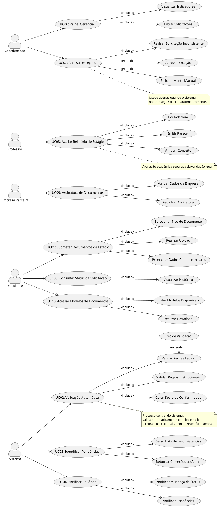

## Casos de uso

---
# Explicação

## UC01 – Submeter Documentos de Estágio

Ator: Estudante
Objetivo: Permitir o envio estruturado dos documentos obrigatórios para validação.

Pré-requisito: Estudante autenticado e com solicitação ativa.

Fluxo principal:

O estudante acessa a área de submissão.
Seleciona o tipo de documento.
Realiza o upload.
Preenche dados complementares.
O sistema armazena os arquivos.

Fluxo alternativo:

Arquivo inválido → sistema rejeita e solicita novo envio.

Pós-requisito: Documentos registrados no sistema.

Regras de negócio:

Apenas formatos PDF ou equivalentes são aceitos.
Todos os documentos obrigatórios devem ser enviados.

---

## UC02 – Validação Automática

Ator: Sistema
Objetivo: Validar documentos com base em regras legais e institucionais.

Pré-requisito: Documentos submetidos.

Fluxo principal:

O sistema inicia a validação.
Aplica regras da Lei 11.788/2008.
Aplica regras institucionais.
Identifica inconsistências.
Calcula o score de conformidade.

Fluxo alternativo:

Falha na leitura → sistema marca como inválido.

Pós-requisito: Resultado de validação registrado.

Regras de negócio:

A validação deve ocorrer em até 15 segundos.
O score deve refletir o nível de conformidade dos documentos.

---

## UC03 – Identificar Pendências

Ator: Sistema
Objetivo: Detectar inconsistências e gerar correções automáticas.

Pré-requisito: Validação concluída.

Fluxo principal:

O sistema analisa os resultados.
Gera lista de pendências.
Associa cada erro a uma regra.
Retorna ao estudante.

Pós-requisito: Pendências registradas e exibidas.

Regras de negócio:

Cada pendência deve conter descrição clara.
Deve indicar exatamente o documento afetado.

---

## UC04 – Notificar Usuários

Atores: Sistema, Estudante
Objetivo: Informar eventos relevantes do processo.

Pré-requisito: Existência de solicitação ativa.

Fluxo principal:

O sistema identifica mudança de estado.
Gera notificação.
Envia ao estudante.

Pós-requisito: Usuário informado.

Regras de negócio:

Notificações devem ocorrer em tempo real ou próximo disso.

---

## UC05 – Consultar Status da Solicitação

Ator: Estudante
Objetivo: Permitir acompanhamento do processo.

Pré-requisito: Solicitação existente.

Fluxo principal:

O estudante acessa suas solicitações.
O sistema exibe status:
Em validação
Pendente
Validado
Em exceção
Exibe histórico.

Pós-requisito: Status visualizado.

Regras de negócio:

Histórico deve ser imutável.

---

## UC06 – Painel Gerencial

Ator: Coordenação
Objetivo: Monitorar o desempenho geral do sistema.

Pré-requisito: Coordenador autenticado.

Fluxo principal:

Acessa painel.
Visualiza indicadores.
Aplica filtros.

Pós-requisito: Visão consolidada disponível.

Regras de negócio:

Dados devem ser atualizados em tempo real.

---

## UC07 – Analisar Exceções

Ator: Coordenação
Objetivo: Tratar casos que não foram resolvidos automaticamente.

Pré-requisito: Solicitação marcada como exceção.

Fluxo principal:

Coordenador acessa caso.
Analisa inconsistências.
Decide:
Aprovar
Solicitar ajuste
Sistema registra decisão.

Pós-requisito: Caso resolvido manualmente.

Regras de negócio:

Intervenção manual só ocorre em exceções.

---

## UC08 – Avaliar Relatório de Estágio

Ator: Professor
Objetivo: Avaliar desempenho acadêmico do estudante.

Pré-requisito: Relatório disponível.

Fluxo principal:

Professor acessa relatório.
Realiza leitura.
Emite parecer.
Atribui conceito.

Pós-requisito: Avaliação registrada.

Regras de negócio:

Avaliação acadêmica é independente da validação legal.

---

## UC09 – Assinatura de Documentos

Ator: Empresa Parceira
Objetivo: Formalizar participação da empresa.

Pré-requisito: Documentos válidos.

Fluxo principal:

Empresa acessa documento.
Verifica dados.
Assina digitalmente.
Sistema registra.

Pós-requisito: Documento assinado.

Regras de negócio:

Assinatura deve garantir autenticidade e integridade.

---

## UC10 – Acessar Modelos de Documentos

Ator: Estudante
Objetivo: Disponibilizar templates oficiais.

Pré-requisito: Usuário autenticado.

Fluxo principal:

Acessa área de modelos.
Visualiza lista.
Realiza download.

Pós-requisito: Documento obtido.

Regras de negócio:

Modelos devem estar sempre atualizados conforme normas institucionais.

---

## Autor(es)
| Data | Versão | Descrição | Autor(es) |
| -- | -- | -- | -- |
| 16/04/2026 | 1.0 | Criação do documento de casos de uso | Gabriel Barreto, Guilherme Braz, Ísis Tavares, Mariana Faria e Matheus Avarenga. |
