## Casos de uso

```plantuml
@startuml Sistema_Validacao_Estagios

left to right direction
skinparam actorStyle awesome

actor Estudante
actor "Empresa Parceira" as Empresa
actor Professor
actor Coordenacao

' ===== CASOS PRINCIPAIS =====

usecase (UC00: Realizar Login) as UC00
usecase (Informar Credenciais Institucionais) as UC00_1
usecase (Validar Acesso) as UC00_2
usecase (Falha de Autenticação) as FA00

usecase (UC01: Abrir Solicitação de Estágio) as UC01
usecase (Selecionar Curso) as UC01_1
usecase (Selecionar Tipo de Solicitação) as UC01_2
usecase (Gerar Checklist Inicial) as UC01_3

usecase (UC02: Submeter Documentos de Estágio) as UC02
usecase (Selecionar Tipo de Documento) as UC02_1
usecase (Realizar Upload) as UC02_2
usecase (Preencher Dados Complementares) as UC02_3
usecase (Validar Formato do Arquivo) as UC02_4
usecase (Arquivo Inválido) as FA01

usecase (UC03: Validar Documentos Automaticamente) as UC03
usecase (Validar Regras Legais) as UC03_1
usecase (Validar Regras Institucionais) as UC03_2
usecase (Gerar Score de Conformidade) as UC03_3
usecase (Erro de Validação) as FA02

usecase (UC04: Identificar Pendências) as UC04
usecase (Gerar Lista de Inconsistências) as UC04_1
usecase (Associar Pendências aos Documentos) as UC04_2
usecase (Retornar Correções ao Aluno) as UC04_3

usecase (UC05: Consultar Status da Solicitação) as UC05
usecase (Visualizar Histórico) as UC05_1
usecase (Visualizar Score de Conformidade) as UC05_2
usecase (Visualizar Pendências) as UC05_3

usecase (UC06: Notificar Usuários) as UC06
usecase (Notificar Mudança de Status) as UC06_1
usecase (Notificar Pendências) as UC06_2
usecase (Notificar Prazo Próximo) as UC06_3

usecase (UC07: Acessar Modelos de Documentos) as UC07
usecase (Listar Modelos Disponíveis) as UC07_1
usecase (Realizar Download) as UC07_2

usecase (UC08: Visualizar Painel Gerencial) as UC08
usecase (Visualizar Indicadores) as UC08_1
usecase (Filtrar Solicitações) as UC08_2
usecase (Consultar Solicitações por Status) as UC08_3

usecase (UC09: Analisar Exceções) as UC09
usecase (Revisar Solicitação Inconsistente) as UC09_1
usecase (Aprovar Exceção) as UC09_2
usecase (Solicitar Ajuste Manual) as UC09_3
usecase (Reprovar Solicitação) as UC09_4

usecase (UC10: Avaliar Relatório de Estágio) as UC10
usecase (Ler Relatório) as UC10_1
usecase (Emitir Parecer) as UC10_2
usecase (Atribuir Conceito) as UC10_3

usecase (UC11: Assinar Documentos) as UC11
usecase (Validar Dados da Empresa) as UC11_1
usecase (Confirmar Informações do Estágio) as UC11_2
usecase (Registrar Assinatura) as UC11_3

' ===== RELACIONAMENTOS DOS ATORES =====

Estudante --> UC00
Estudante --> UC01
Estudante --> UC02
Estudante --> UC05
Estudante --> UC06
Estudante --> UC07

Professor --> UC00
Professor --> UC10

Coordenacao --> UC00
Coordenacao --> UC06
Coordenacao --> UC08
Coordenacao --> UC09

Empresa --> UC11

' ===== RELAÇÕES ENTRE CASOS =====

UC00 --> UC00_1 : <<include>>
UC00 --> UC00_2 : <<include>>
FA00 .> UC00_2 : <<extend>>

UC01 --> UC01_1 : <<include>>
UC01 --> UC01_2 : <<include>>
UC01 --> UC01_3 : <<include>>

UC02 --> UC02_1 : <<include>>
UC02 --> UC02_2 : <<include>>
UC02 --> UC02_3 : <<include>>
UC02 --> UC02_4 : <<include>>
FA01 .> UC02_4 : <<extend>>

UC02 .> UC03 : <<include>>

UC03 --> UC03_1 : <<include>>
UC03 --> UC03_2 : <<include>>
UC03 --> UC03_3 : <<include>>
FA02 .> UC03_1 : <<extend>>

UC03 .> UC04 : <<extend>>
UC03 .> UC06 : <<extend>>

UC04 --> UC04_1 : <<include>>
UC04 --> UC04_2 : <<include>>
UC04 --> UC04_3 : <<include>>
UC04 .> UC06 : <<include>>

UC05 --> UC05_1 : <<include>>
UC05 --> UC05_2 : <<include>>
UC05 --> UC05_3 : <<include>>

UC06 --> UC06_1 : <<include>>
UC06 --> UC06_2 : <<include>>
UC06 --> UC06_3 : <<include>>

UC07 --> UC07_1 : <<include>>
UC07 --> UC07_2 : <<include>>

UC08 --> UC08_1 : <<include>>
UC08 --> UC08_2 : <<include>>
UC08 --> UC08_3 : <<include>>

UC09 --> UC09_1 : <<include>>
UC09 --> UC09_2 : <<extend>>
UC09 --> UC09_3 : <<extend>>
UC09 --> UC09_4 : <<extend>>
UC09 .> UC06 : <<include>>

UC10 --> UC10_1 : <<include>>
UC10 --> UC10_2 : <<include>>
UC10 --> UC10_3 : <<include>>

UC11 --> UC11_1 : <<include>>
UC11 --> UC11_2 : <<include>>
UC11 --> UC11_3 : <<include>>
UC11 .> UC06 : <<include>>

' ===== NOTAS =====

note right of UC03
  Processo central do sistema.
  A validação ocorre automaticamente
  com base na Lei 11.788/2008
  e nas regras institucionais.
end note

note right of UC09
  A coordenação atua apenas
  quando o sistema identifica
  casos excepcionais ou inconsistentes.
end note

note right of UC10
  A avaliação acadêmica do professor
  é separada da validação documental.
end note

note bottom of UC06
  As notificações podem ocorrer
  por dashboard, e-mail ou outro
  canal institucional definido.
end note

@enduml
```

---
# Explicação

## UC00 – Realizar Login

Atores: Estudante, Professor, Coordenação
Objetivo: Permitir acesso seguro ao sistema por meio de credenciais institucionais.

Pré-requisito: O usuário deve possuir cadastro ativo e credenciais válidas.

Fluxo principal:

O usuário acessa a tela inicial.
Informa suas credenciais institucionais.
O sistema valida o acesso.
O sistema redireciona o usuário para a interface correspondente ao seu perfil.

Fluxo alternativo:

Credenciais inválidas → o sistema exibe mensagem de erro e solicita nova tentativa.

Pós-requisito: Usuário autenticado no sistema.

Regras de negócio:

O acesso deve ser restrito a usuários autorizados.
A autenticação deve usar e-mail ou credenciais institucionais válidas.

---

## UC01 – Abrir Solicitação de Estágio

Ator: Estudante
Objetivo: Permitir a abertura de uma nova solicitação de validação de estágio.

Pré-requisito: Estudante autenticado.

Fluxo principal:

O estudante acessa a área de solicitações.
Seleciona o curso.
Seleciona o tipo de solicitação.
O sistema gera o checklist inicial de documentos exigidos.
A solicitação é registrada.

Pós-requisito: Solicitação ativa criada no sistema.

Regras de negócio:

Cada solicitação deve estar vinculada ao estudante responsável.
O checklist inicial deve respeitar as regras do curso e da instituição.

---

## UC02 – Submeter Documentos de Estágio

Ator: Estudante
Objetivo: Permitir o envio estruturado dos documentos obrigatórios para validação.

Pré-requisito: Estudante autenticado e com solicitação ativa.

Fluxo principal:

O estudante acessa a área de submissão.
Seleciona o tipo de documento.
Realiza o upload do arquivo.
O sistema valida o formato do arquivo.
O estudante preenche os dados complementares.
O sistema armazena os arquivos enviados.
O sistema encaminha a solicitação para validação automática.

Fluxo alternativo:

Arquivo inválido → o sistema rejeita o envio e solicita novo arquivo.
Documento incompleto → o sistema solicita o preenchimento dos dados obrigatórios.

Pós-requisito: Documentos registrados no sistema e vinculados à solicitação.

Regras de negócio:

Apenas formatos aceitos pela instituição podem ser enviados.
Todos os documentos obrigatórios devem ser submetidos.
Cada documento deve estar associado ao tipo correspondente.

---

## UC03 – Validar Documentos Automaticamente

Ator: Sistema
Objetivo: Validar os documentos submetidos com base em regras legais e institucionais.

Pré-requisito: Documentos submetidos corretamente.

Fluxo principal:

O sistema inicia o processamento da solicitação.
Aplica as regras da Lei 11.788/2008.
Aplica as regras institucionais.
Analisa os documentos enviados.
Identifica inconsistências.
Gera o score de conformidade.
Registra o resultado da validação.

Fluxo alternativo:

Falha na leitura dos arquivos → o sistema registra erro de validação.
Documento ilegível ou inconsistente → o sistema encaminha a solicitação para tratamento de pendências ou exceção.

Pós-requisito: Resultado da validação automática registrado no sistema.

Regras de negócio:

A validação deve ocorrer em tempo reduzido, preferencialmente em até 15 segundos.
O score deve refletir o grau de conformidade da solicitação.
A validação automática deve considerar simultaneamente regras legais e institucionais.

---

## UC04 – Identificar Pendências

Ator: Sistema
Objetivo: Detectar inconsistências e orientar as correções necessárias ao estudante.

Pré-requisito: Validação automática concluída.

Fluxo principal:

O sistema analisa os resultados da validação.
Gera a lista de inconsistências encontradas.
Associa cada pendência ao documento correspondente.
Retorna as correções necessárias ao estudante.

Pós-requisito: Pendências registradas e disponibilizadas para consulta.

Regras de negócio:

Cada pendência deve conter descrição clara e objetiva.
Cada pendência deve indicar exatamente o documento afetado.
As pendências devem ser apresentadas de forma compreensível ao estudante.

---

## UC05 – Consultar Status da Solicitação

Ator: Estudante
Objetivo: Permitir o acompanhamento do andamento da solicitação.

Pré-requisito: Existência de solicitação registrada.

Fluxo principal:

O estudante acessa a área de solicitações.
Seleciona a solicitação desejada.
O sistema exibe o status atual.
O sistema exibe o histórico da solicitação.
O sistema exibe o score de conformidade e as pendências, quando existirem.

Pós-requisito: Situação atual da solicitação visualizada pelo estudante.

Regras de negócio:

O histórico da solicitação deve ser preservado.
O estudante só pode visualizar suas próprias solicitações.

---

## UC06 – Notificar Usuários

Atores: Sistema, Estudante, Coordenação
Objetivo: Informar eventos relevantes relacionados ao processo de validação.

Pré-requisito: Existência de solicitação ativa ou evento associado ao processo.

Fluxo principal:

O sistema identifica uma mudança de estado ou evento relevante.
Gera a notificação correspondente.
Encaminha a notificação ao usuário envolvido.
O usuário visualiza a notificação.

Pós-requisito: Usuário informado sobre o evento ocorrido.

Regras de negócio:

As notificações podem ocorrer por dashboard, e-mail ou outro canal institucional.
As notificações devem ocorrer em tempo real ou próximo disso.
Devem ser notificadas mudanças de status, pendências e prazos próximos.

---

## UC07 – Acessar Modelos de Documentos

Ator: Estudante
Objetivo: Disponibilizar os modelos oficiais exigidos pela instituição.

Pré-requisito: Estudante autenticado.

Fluxo principal:

O estudante acessa a área de modelos.
O sistema lista os modelos disponíveis.
O estudante seleciona o modelo desejado.
O sistema realiza o download do arquivo.

Pós-requisito: Modelo oficial disponibilizado ao estudante.

Regras de negócio:

Os modelos devem estar atualizados conforme as normas institucionais.
Somente documentos homologados pela instituição devem ser disponibilizados.

---

## UC08 – Visualizar Painel Gerencial

Ator: Coordenação
Objetivo: Permitir o acompanhamento geral das solicitações de estágio.

Pré-requisito: Coordenador autenticado.

Fluxo principal:

O coordenador acessa o painel gerencial.
O sistema exibe os indicadores principais.
O coordenador aplica filtros de consulta.
O sistema apresenta as solicitações por status, curso ou outro critério definido.

Pós-requisito: Visão consolidada das solicitações disponível para a coordenação.

Regras de negócio:

Os dados do painel devem estar atualizados.
O painel deve permitir acompanhamento de indicadores e acompanhamento por filtros.

---

## UC09 – Analisar Exceções

Ator: Coordenação
Objetivo: Tratar solicitações que não puderam ser resolvidas integralmente pela validação automática.

Pré-requisito: Solicitação marcada como exceção ou inconsistente.

Fluxo principal:

O coordenador acessa a solicitação em exceção.
Revisa as inconsistências apontadas pelo sistema.
Analisa a documentação submetida.
Decide entre aprovar a exceção, solicitar ajuste manual ou reprovar a solicitação.
O sistema registra a decisão tomada.
O sistema atualiza o status da solicitação.

Pós-requisito: Solicitação excepcional tratada e registrada.

Regras de negócio:

A intervenção manual deve ocorrer apenas em casos excepcionais.
Toda decisão da coordenação deve ficar registrada para auditoria.

---

## UC10 – Avaliar Relatório de Estágio

Ator: Professor
Objetivo: Realizar a avaliação acadêmica do relatório de estágio.

Pré-requisito: Relatório de estágio disponível no sistema.

Fluxo principal:

O professor acessa o relatório submetido.
Realiza a leitura do documento.
Emite um parecer técnico.
Atribui o conceito final ao estudante.
O sistema registra a avaliação.

Pós-requisito: Avaliação acadêmica registrada no sistema.

Regras de negócio:

A avaliação acadêmica deve ser separada da validação documental.
Somente professores autorizados podem avaliar relatórios.

---

## UC11 – Assinar Documentos

Ator: Empresa Parceira
Objetivo: Formalizar a participação da empresa no processo de estágio.

Pré-requisito: Documento disponível para assinatura e dados do estágio previamente validados.

Fluxo principal:

A empresa acessa o documento correspondente.
O sistema apresenta os dados do estágio.
A empresa valida as informações apresentadas.
A empresa confirma a assinatura.
O sistema registra a assinatura no documento.

Pós-requisito: Documento formalizado com assinatura da empresa.

Regras de negócio:

A assinatura deve garantir autenticidade e integridade.
Somente representantes autorizados da empresa podem assinar os documentos.

---

## Autor(es)
| Data | Versão | Descrição | Autor(es) |
| -- | -- | -- | -- |
| 16/04/2026 | 1.0 | Criação do documento de casos de uso | Gabriel Barreto, Guilherme Braz, Ísis Tavares, Mariana Faria e Matheus Avarenga. |
