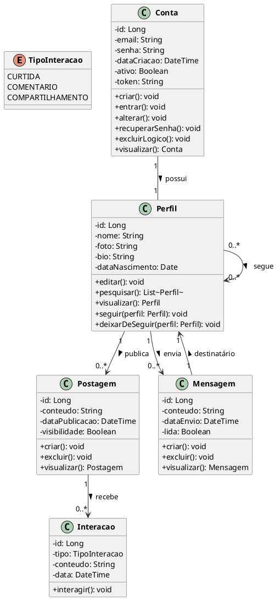

## Diagrama de Classes

## Descrição das Classes

### Conta
Representa as credenciais de acesso do usuário. Gerencia autenticação, recuperação de senha e exclusão lógica (soft delete).

### Perfil
Dados públicos do usuário. Um perfil pode seguir outros perfis, publicar postagens e enviar mensagens.

### Postagem
Conteúdo público criado pelo usuário. Pode receber interações (curtidas, comentários e compartilhamentos).

### Interacao
Representa as reações a uma postagem: curtida, comentário ou compartilhamento.

### Mensagem
Comunicação privada entre dois perfis.

## Versionamento

| Data | Versão | Descrição | Autor(es) |
| -- | -- | -- | -- |
| 16/04/2026 | 1.0 | Criação do diagrama de classes | Gabriel Barreto, Guilherme Braz, Ísis Tavares, Mariana Faria e Matheus Alvarenga |
