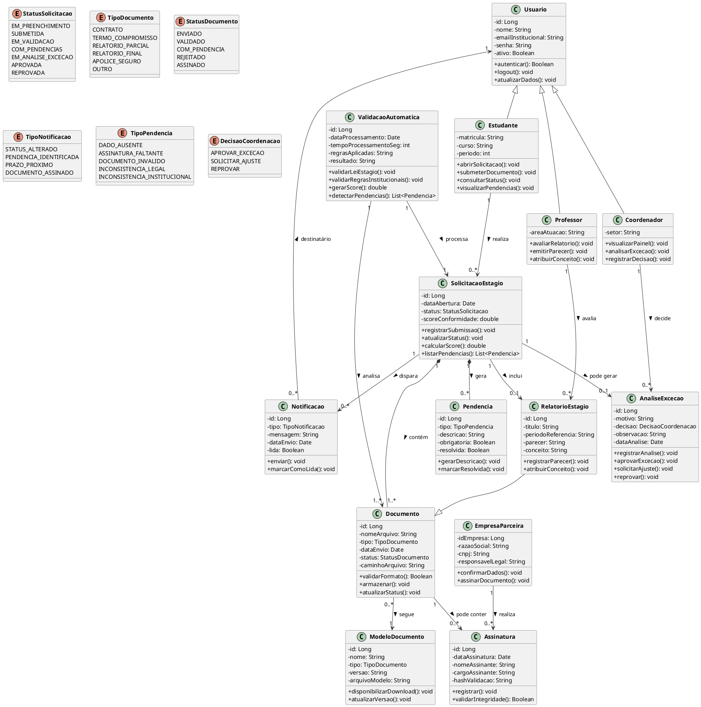

## Diagrama de Classes

## Descrição das Classes

## Usuario: Classe base responsável por representar os usuários do sistema. Armazena dados comuns de autenticação e identificação, como nome, e-mail institucional, senha e status de ativação.

## Estudante: Representa o aluno que solicita a validação do estágio. Pode abrir solicitações, enviar documentos, consultar status e visualizar pendências.

## Professor: Representa o docente responsável pela análise acadêmica dos relatórios de estágio. Pode avaliar relatórios, emitir pareceres e atribuir conceitos.

## Coordenador: Representa o responsável pelo acompanhamento gerencial do processo. Pode visualizar indicadores, analisar exceções e registrar decisões em casos não resolvidos automaticamente.

## EmpresaParceira: Representa a organização que oferece a oportunidade de estágio. É responsável por confirmar dados institucionais e realizar assinaturas nos documentos exigidos.

## SolicitacaoEstagio: Classe central do sistema. Representa cada processo de validação de estágio iniciado por um estudante, armazenando data de abertura, status atual, score de conformidade e vínculos com documentos, pendências e análises.

## Documento: Representa os arquivos submetidos no sistema, como contrato, termo de compromisso, apólice e relatórios. Armazena informações sobre tipo, nome do arquivo, data de envio, caminho de armazenamento e status do documento.

## ValidacaoAutomatica: Representa o módulo responsável por aplicar as regras legais e institucionais aos documentos submetidos. Executa a validação, detecta inconsistências, calcula o score de conformidade e gera pendências.

## Pendencia: Representa problemas identificados durante a validação automática, como ausência de dados, assinaturas faltantes ou inconsistências legais e institucionais. Cada pendência possui descrição e estado de resolução.

## Notificacao: Representa os avisos enviados pelo sistema aos usuários sobre alterações de status, pendências identificadas, prazos próximos ou documentos assinados.

## ModeloDocumento: Representa os modelos padronizados de documentos disponibilizados pela instituição para download, como formulários e termos oficiais.

## Assinatura: Representa o registro da assinatura realizada em um documento, armazenando dados como nome do assinante, cargo, data da assinatura e mecanismo de validação.

## RelatorioEstagio: Representa um tipo específico de documento ligado à avaliação acadêmica. Além das informações básicas de documento, permite registrar parecer e conceito atribuídos pelo professor.

## AnaliseExcecao: Representa o tratamento manual feito pela coordenação quando uma solicitação não pode ser resolvida de forma totalmente automática. Armazena o motivo, a decisão tomada, observações e data da análise.

## Versionamento

## Versão 1.0: Definição inicial das classes principais do sistema, contemplando usuários, solicitações, documentos, validação automática, pendências e notificações.

## Versão 1.1: Inclusão das classes RelatorioEstagio e AnaliseExcecao para separar a avaliação acadêmica da validação documental e representar a atuação da coordenação em casos excepcionais.

## Versão 1.2: Refinamento dos relacionamentos entre as classes e inclusão de enums de apoio para padronizar status, tipos de documentos, notificações, pendências e decisões.

## Versão atual: Estrutura orientada a objetos compatível com a proposta do sistema de validação de estágios, com foco em automação, rastreabilidade, apoio à coordenação e conformidade com regras institucionais e legais.

| Data | Versão | Descrição | Autor(es) |
| -- | -- | -- | -- |
| 16/04/2026 | 1.0 | Criação do diagrama de classes | Gabriel Barreto, Guilherme Braz, Ísis Tavares, Mariana Faria e Matheus Alvarenga |
