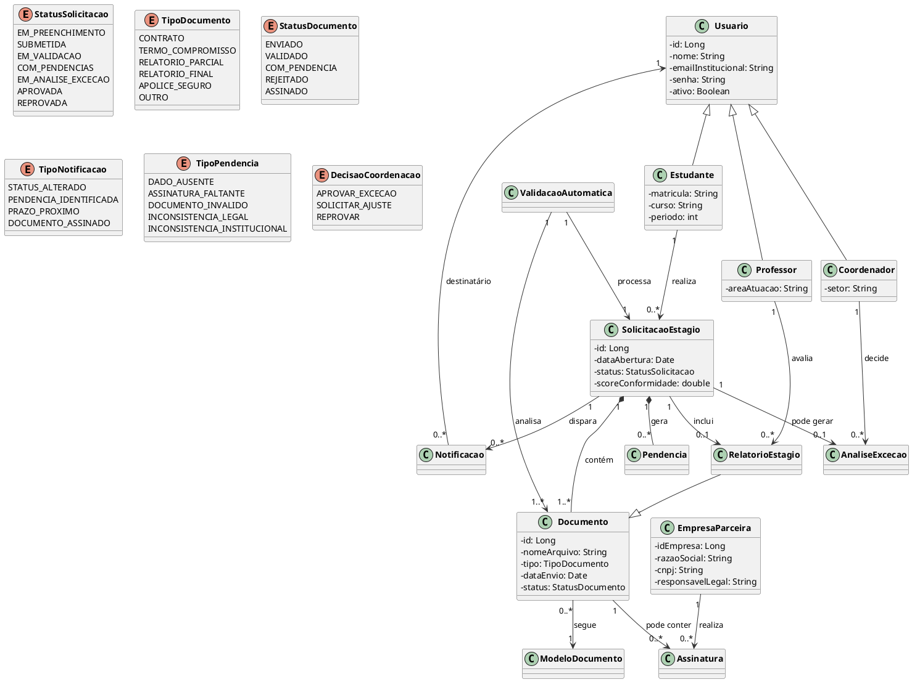

## Diagrama de Classes

```plantuml
@startuml Diagrama_Classes_Sistema_Validacao_Estagios

skinparam classAttributeIconSize 0
skinparam classFontStyle bold
skinparam ArrowColor #333333
skinparam ClassBorderColor #555555

enum StatusSolicitacao {
  EM_PREENCHIMENTO
  SUBMETIDA
  EM_VALIDACAO
  COM_PENDENCIAS
  EM_ANALISE_EXCECAO
  APROVADA
  REPROVADA
}

enum TipoDocumento {
  CONTRATO
  TERMO_COMPROMISSO
  RELATORIO_PARCIAL
  RELATORIO_FINAL
  APOLICE_SEGURO
  OUTRO
}

enum StatusDocumento {
  ENVIADO
  VALIDADO
  COM_PENDENCIA
  REJEITADO
  ASSINADO
}

enum TipoNotificacao {
  STATUS_ALTERADO
  PENDENCIA_IDENTIFICADA
  PRAZO_PROXIMO
  DOCUMENTO_ASSINADO
}

enum TipoPendencia {
  DADO_AUSENTE
  ASSINATURA_FALTANTE
  DOCUMENTO_INVALIDO
  INCONSISTENCIA_LEGAL
  INCONSISTENCIA_INSTITUCIONAL
}

enum DecisaoCoordenacao {
  APROVAR_EXCECAO
  SOLICITAR_AJUSTE
  REPROVAR
}

class Usuario {
  - id: Long
  - nome: String
  - emailInstitucional: String
  - senha: String
  - ativo: Boolean
}

class Estudante {
  - matricula: String
  - curso: String
  - periodo: int
}

class Professor {
  - areaAtuacao: String
}

class Coordenador {
  - setor: String
}

class EmpresaParceira {
  - idEmpresa: Long
  - razaoSocial: String
  - cnpj: String
  - responsavelLegal: String
}

class SolicitacaoEstagio {
  - id: Long
  - dataAbertura: Date
  - status: StatusSolicitacao
  - scoreConformidade: double
}

class Documento {
  - id: Long
  - nomeArquivo: String
  - tipo: TipoDocumento
  - dataEnvio: Date
  - status: StatusDocumento
}

class ValidacaoAutomatica
class Pendencia
class Notificacao
class ModeloDocumento
class Assinatura
class RelatorioEstagio
class AnaliseExcecao

Usuario <|-- Estudante
Usuario <|-- Professor
Usuario <|-- Coordenador

Estudante "1" --> "0..*" SolicitacaoEstagio : realiza
SolicitacaoEstagio "1" *-- "1..*" Documento : contém
SolicitacaoEstagio "1" *-- "0..*" Pendencia : gera
SolicitacaoEstagio "1" --> "0..*" Notificacao : dispara
SolicitacaoEstagio "1" --> "0..1" AnaliseExcecao : pode gerar
SolicitacaoEstagio "1" --> "0..1" RelatorioEstagio : inclui

ValidacaoAutomatica "1" --> "1" SolicitacaoEstagio : processa
ValidacaoAutomatica "1" --> "1..*" Documento : analisa

Professor "1" --> "0..*" RelatorioEstagio : avalia
Coordenador "1" --> "0..*" AnaliseExcecao : decide
EmpresaParceira "1" --> "0..*" Assinatura : realiza

Documento "1" --> "0..*" Assinatura : pode conter
Documento "0..*" --> "1" ModeloDocumento : segue
RelatorioEstagio --|> Documento

Notificacao "0..*" --> "1" Usuario : destinatário

@enduml
```

## Visão Geral

O diagrama de classes do Sistema de Validação de Estágios representa a estrutura estática do sistema, descrevendo as entidades, seus atributos, métodos e relacionamentos. O modelo foi desenvolvido para apoiar o gerenciamento do processo de estágio, incluindo submissão de documentos, validação automática, análise de pendências e acompanhamento do status da solicitação.

## Visão Geral das Classes 

### 1. Identidade e Atores

Responsável por representar os usuários do sistema e os atores envolvidos no processo de estágio.

#### Classes

| Classe            | Responsabilidade                                                                  |
| ----------------- | --------------------------------------------------------------------------------- |
| `Usuario`         | Classe base do sistema com informações comuns de autenticação e identificação.    |
| `Estudante`       | Usuário responsável por abrir e acompanhar solicitações de estágio.               |
| `Professor`       | Responsável pela avaliação dos relatórios de estágio.                             |
| `Coordenador`     | Responsável pela tomada de decisão em análises de exceção.                        |
| `EmpresaParceira` | Organização onde o estágio será realizado e responsável pelas assinaturas legais. |

#### Objetivo do bloco

Garantir o controle de acesso, identificação dos perfis e definição das responsabilidades no fluxo do estágio.

---

### 2. Núcleo do Processo

Representa as principais entidades operacionais do processo de validação do estágio.

### Classes

| Classe               | Responsabilidade                                                                |
| -------------------- | ------------------------------------------------------------------------------- |
| `SolicitacaoEstagio` | Classe central do sistema. Controla o ciclo de vida da solicitação de estágio.  |
| `Documento`          | Representa os arquivos enviados durante o processo.                             |
| `ModeloDocumento`    | Define os padrões exigidos para documentos institucionais.                      |
| `RelatorioEstagio`   | Especialização de documento utilizada para acompanhamento acadêmico do estágio. |
| `Assinatura`         | Gerencia as assinaturas eletrônicas ou validações formais dos documentos.       |

### Objetivo do bloco

Executar o fluxo principal do estágio, desde a abertura da solicitação até a entrega da documentação obrigatória.

---

## 3. Validação e Conformidade

Responsável pela automação das verificações legais, acadêmicas e institucionais.

### Classes

| Classe                | Responsabilidade                                                 |
| --------------------- | ---------------------------------------------------------------- |
| `ValidacaoAutomatica` | Processa automaticamente os documentos e regras de conformidade. |
| `Pendencia`           | Registra inconsistências encontradas durante validações.         |
| `AnaliseExcecao`      | Trata casos fora das regras padrão do processo.                  |

### Objetivo do bloco

Automatizar validações, reduzir retrabalho e direcionar casos complexos para análise humana.

---

## 4. Acompanhamento e Governança

Responsável pela comunicação do andamento do processo.

### Classes

| Classe        | Responsabilidade                                                                |
| ------------- | ------------------------------------------------------------------------------- |
| `Notificacao` | Envia alertas relacionados a status, pendências, prazos e documentos assinados. |

### Objetivo do bloco

Garantir transparência e acompanhamento contínuo por parte dos envolvidos.

---

## 5. Tipos e Estados do Sistema

Enums utilizados para padronizar regras e estados do sistema.

### Classes Enumeradas (Enums)

| Enum                 | Finalidade                                      |
| -------------------- | ----------------------------------------------- |
| `StatusSolicitacao`  | Define o estado da solicitação de estágio.      |
| `TipoDocumento`      | Categoriza os documentos enviados.              |
| `StatusDocumento`    | Representa o estágio de validação do documento. |
| `TipoNotificacao`    | Define categorias de mensagens enviadas.        |
| `TipoPendencia`      | Categoriza inconsistências encontradas.         |
| `DecisaoCoordenacao` | Representa decisões tomadas pelo coordenador.   |

### Objetivo do bloco

Padronizar regras de negócio e reduzir inconsistências no sistema.

---

## Arquitetura Geral do Sistema

O sistema possui como entidade principal a classe:

### `SolicitacaoEstagio`

Ela centraliza todo o processo e se relaciona com:

* `Estudante` → realiza a solicitação;
* `Documento` → compõe a solicitação;
* `Pendencia` → inconsistências encontradas;
* `Notificacao` → comunicação do andamento;
* `AnaliseExcecao` → tratamento de situações especiais;
* `RelatorioEstagio` → acompanhamento acadêmico;
* `ValidacaoAutomatica` → execução das verificações.

Essa estrutura organiza o sistema em módulos bem definidos, facilitando manutenção, escalabilidade e separação de responsabilidades.

## Estrutura do Sistema

O sistema possui três tipos principais de usuários: estudante, professor e coordenador, todos derivados da classe `Usuario`. O estudante é responsável pela abertura da solicitação de estágio e envio de documentos, o professor realiza a avaliação dos relatórios e o coordenador conduz análises de exceção e decisões administrativas.

A classe central do sistema é `SolicitacaoEstagio`, responsável por armazenar informações do processo, status da solicitação, score de conformidade e relacionamentos com documentos, pendências e notificações.

### Principais Classes

#### Usuario
Classe base responsável pela autenticação e gerenciamento dos usuários do sistema.

**Atributos principais:**
- id
- nome
- emailInstitucional
- senha
- ativo

**Métodos principais:**
- autenticar()
- logout()
- atualizarDados()

---

#### Estudante
Representa o aluno que solicita o estágio.

**Responsabilidades:**
- Abrir solicitação
- Submeter documentos
- Consultar status
- Visualizar pendências

Relacionamento:
Um estudante pode realizar várias solicitações de estágio.

---

#### Professor
Representa o responsável pela avaliação dos relatórios de estágio.

**Responsabilidades:**
- Avaliar relatório
- Emitir parecer
- Atribuir conceito

---

#### Coordenador
Responsável pela análise de exceções e decisões administrativas.

**Responsabilidades:**
- Visualizar painel
- Analisar exceções
- Registrar decisões

---

#### SolicitacaoEstagio
Classe principal do sistema.

**Responsabilidades:**
- Registrar submissão
- Atualizar status
- Calcular score de conformidade
- Listar pendências

Relacionamentos:
- Contém documentos
- Gera pendências
- Dispara notificações
- Pode gerar análise de exceção
- Pode incluir relatório de estágio

---

#### Documento
Representa arquivos enviados no processo.

**Responsabilidades:**
- Validar formato
- Armazenar documento
- Atualizar status

---

#### ValidacaoAutomatica
Executa verificações automáticas de conformidade.

**Responsabilidades:**
- Validar Lei do Estágio
- Verificar regras institucionais
- Gerar score
- Detectar pendências

---

#### Pendencia
Representa inconsistências detectadas no processo.

#### Notificacao
Responsável pelo envio de mensagens aos usuários.

#### ModeloDocumento
Armazena templates oficiais utilizados pelo sistema.

#### Assinatura
Representa assinaturas realizadas em documentos.

#### RelatorioEstagio
Especialização de documento destinada à avaliação acadêmica.

#### AnaliseExcecao
Representa situações analisadas pela coordenação.

## Relacionamentos do Modelo

- `Usuario` é superclasse de `Estudante`, `Professor` e `Coordenador`;
- `Estudante` realiza `SolicitacaoEstagio`;
- `SolicitacaoEstagio` contém `Documento`;
- `SolicitacaoEstagio` gera `Pendencia`;
- `SolicitacaoEstagio` dispara `Notificacao`;
- `SolicitacaoEstagio` pode gerar `AnaliseExcecao`;
- `Professor` avalia `RelatorioEstagio`;
- `Coordenador` decide `AnaliseExcecao`;
- `Documento` pode conter `Assinatura`;
- `RelatorioEstagio` herda de `Documento`.

## Objetivo do Diagrama

O diagrama de classes foi desenvolvido para representar a estrutura do sistema de forma organizada, auxiliando na implementação orientada a objetos, compreensão das responsabilidades de cada entidade e manutenção do software.

## Descrição das Classes

### Usuario: Classe base responsável por representar os usuários do sistema. Armazena dados comuns de autenticação e identificação, como nome, e-mail institucional, senha e status de ativação.

### Estudante: Representa o aluno que solicita a validação do estágio. Pode abrir solicitações, enviar documentos, consultar status e visualizar pendências.

### Professor: Representa o docente responsável pela análise acadêmica dos relatórios de estágio. Pode avaliar relatórios, emitir pareceres e atribuir conceitos.

### Coordenador: Representa o responsável pelo acompanhamento gerencial do processo. Pode visualizar indicadores, analisar exceções e registrar decisões em casos não resolvidos automaticamente.

### EmpresaParceira: Representa a organização que oferece a oportunidade de estágio. É responsável por confirmar dados institucionais e realizar assinaturas nos documentos exigidos.

### SolicitacaoEstagio: Classe central do sistema. Representa cada processo de validação de estágio iniciado por um estudante, armazenando data de abertura, status atual, score de conformidade e vínculos com documentos, pendências e análises.

### Documento: Representa os arquivos submetidos no sistema, como contrato, termo de compromisso, apólice e relatórios. Armazena informações sobre tipo, nome do arquivo, data de envio, caminho de armazenamento e status do documento.

### ValidacaoAutomatica: Representa o módulo responsável por aplicar as regras legais e institucionais aos documentos submetidos. Executa a validação, detecta inconsistências, calcula o score de conformidade e gera pendências.

### Pendencia: Representa problemas identificados durante a validação automática, como ausência de dados, assinaturas faltantes ou inconsistências legais e institucionais. Cada pendência possui descrição e estado de resolução.

### Notificacao: Representa os avisos enviados pelo sistema aos usuários sobre alterações de status, pendências identificadas, prazos próximos ou documentos assinados.

### ModeloDocumento: Representa os modelos padronizados de documentos disponibilizados pela instituição para download, como formulários e termos oficiais.

### Assinatura: Representa o registro da assinatura realizada em um documento, armazenando dados como nome do assinante, cargo, data da assinatura e mecanismo de validação.

### RelatorioEstagio: Representa um tipo específico de documento ligado à avaliação acadêmica. Além das informações básicas de documento, permite registrar parecer e conceito atribuídos pelo professor.

### AnaliseExcecao: Representa o tratamento manual feito pela coordenação quando uma solicitação não pode ser resolvida de forma totalmente automática. Armazena o motivo, a decisão tomada, observações e data da análise.

## Versionamento

### Versão 1.0: Definição inicial das classes principais do sistema, contemplando usuários, solicitações, documentos, validação automática, pendências e notificações.

### Versão 1.1: Inclusão das classes RelatorioEstagio e AnaliseExcecao para separar a avaliação acadêmica da validação documental e representar a atuação da coordenação em casos excepcionais.

### Versão 1.2: Refinamento dos relacionamentos entre as classes e inclusão de enums de apoio para padronizar status, tipos de documentos, notificações, pendências e decisões.

### Versão atual: Estrutura orientada a objetos compatível com a proposta do sistema de validação de estágios, com foco em automação, rastreabilidade, apoio à coordenação e conformidade com regras institucionais e legais.

| Data | Versão | Descrição | Autor(es) |
| -- | -- | -- | -- |
| 16/04/2026 | 1.0 | Criação do diagrama de classes | Gabriel Barreto, Guilherme Braz, Ísis Tavares, Mariana Faria e Matheus Alvarenga |
