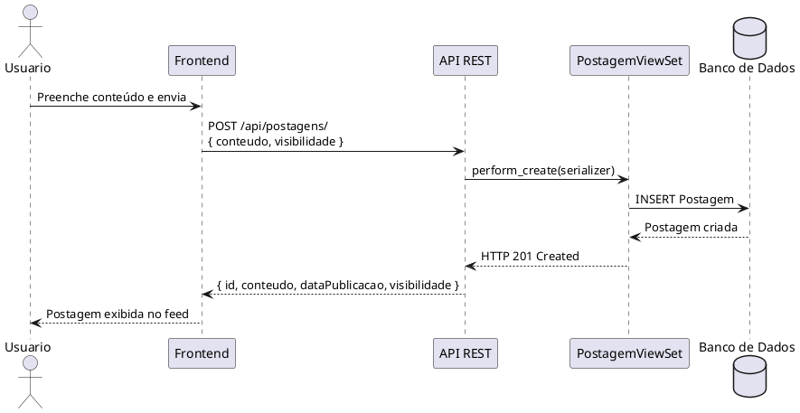
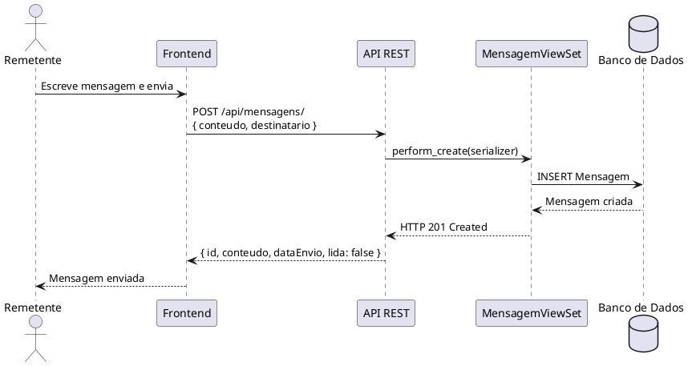
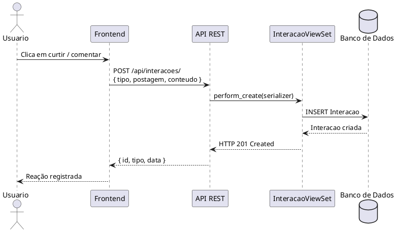

## Diagrama de Sequência

### Fluxo: Publicar Postagem

### Fluxo: Enviar Mensagem

### Fluxo: Interagir com Postagem

## Versionamento

| Data | Versão | Descrição | Autor(es) |
| -- | -- | -- | -- |
| 28/05/2026 | 1.0 | Criação do diagrama de sequência | Gabriel Barreto, Guilherme Braz, Ísis Tavares, Mariana Faria e Matheus Alvarenga |
