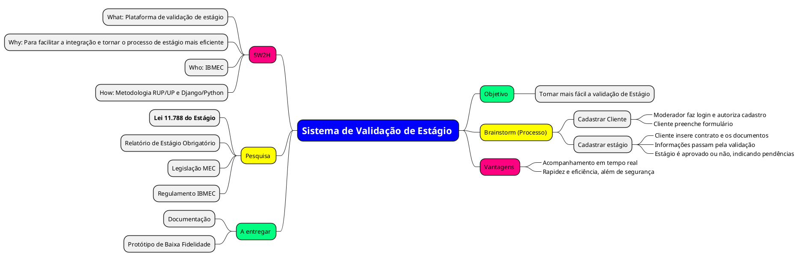

 
## Introdução
 

Mapa mental consiste em criar resumos cheios de símbolos, cores, setas e frases de efeito com o objetivo de organizar o conteúdo e facilitar associações entre as informações destacadas. Esse material é muito indicado para pessoas que têm facilidade de aprender de forma visual.

 
## Metodologia
 

Foram levantados pontos chaves do nosso projeto para que possamos orgalizá-los de uma forma fácil e rápida de entender. Foi Utilizado o PlantUML.

 
## Mapa mental

## Referências

> PlantUML. Disponível em: https://www.planttext.com/
 

## Versionamento
| Data | Versão | Descrição | Autor(es) |
| -- | -- | -- | -- |
| 07/04/2026 | 1.0 | Criação do documento | Gabriel Barreto, Guilherme Braz, Ísis Tavares, Mariana Faria e Matheus Avarenga |
