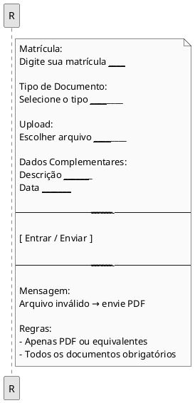
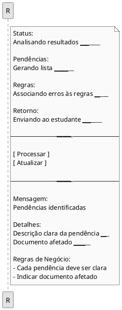
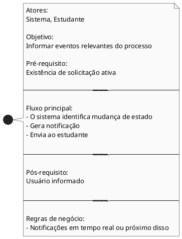
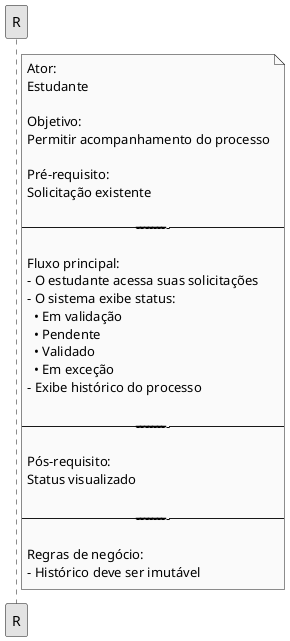
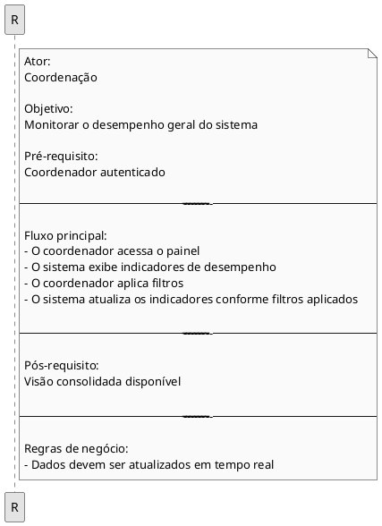
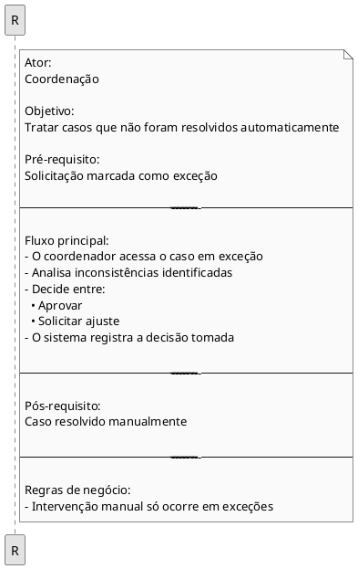
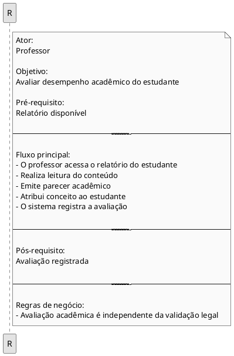
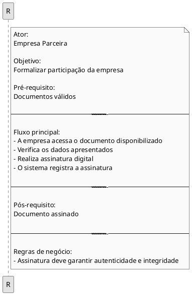
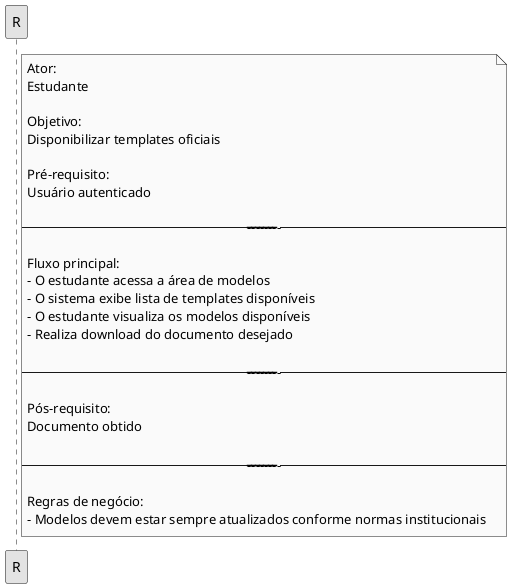

## Introdução

<p align = "justify">
Um protótipo de baixa fidelidade é uma representação visual simplificada de um sistema ou aplicação, voltada para a comunicação universal de suas funcionalidades e fluxos. A proposta desse tipo de protótipo é oferecer uma forma clara e acessível de representar o funcionamento geral da aplicação.
</p>

## Metodologia

<p align = "justify">
O desenvolvimento dos protótipos de baixa fidelidade teve início com a coleta de ideias por meio de reuniões colaborativas e construção de mapas mentais, utilizando brainstorming para compreender as demandas dos usuários.
</p>

## Protótipo de baixa fidelidade


### Submeter Documentos de Estágio

###  Validação Automática

```puml
@startuml

skinparam monochrome true
skinparam shadowing false

rectangle "Validação de Documentos" {
Status:
Iniciando validação ____________________

Regras Legais:
Aplicando Lei 11.788/2008 _____________

Regras Institucionais:
Validando critérios internos ___________

Análise:
Identificando inconsistências __________

Score de Conformidade:
Calculando ____________________________

----------------------------------------

[ Processar ]
[ Atualizar ]

----------------------------------------

Mensagem:
Falha na leitura -> documento inválido

Resultado:
Validação registrada ___________________

Regras:
- Tempo máximo: 15 segundos
- Score baseado na conformidade
}

@enduml
```


### Identificar Pendências


###  Notificar Usuários


### Consultar Status da Solicitação


###  Painel Gerencial


###  Analisar Exceções


### Avaliar Relatório de Estágio

### Assinatura de Documentos


### Acessar Modelos de Documentos



## Conclusão

<p align = "justify">
A construção dos protótipos de baixa fidelidade permitiu visualizar de forma clara as funcionalidades e fluxos do sistema, facilitando a comunicação entre os envolvidos no projeto.
</p>


## Autor(es)

| Data     | Versão | Descrição                            | Autor(es)                                                                            |
| -------- | ------- | -------------------------------------- | ------------------------------------------------------------------------------------ |
| 15/04/26 | 1.0     | Criação do Prototipo               |   Gabriel Barreto, Guilherme Braz, Ísis Tavares, Mariana Faria e Matheus Alvarenga                                              |
