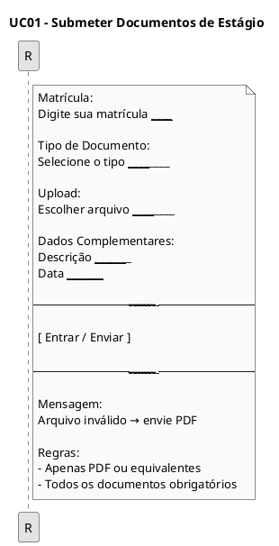
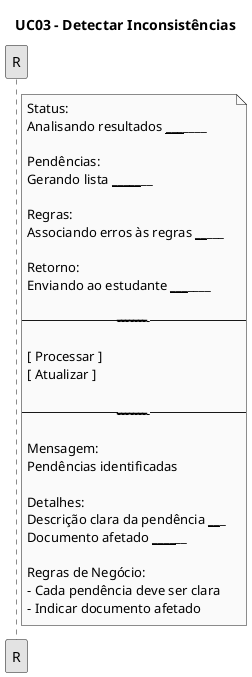
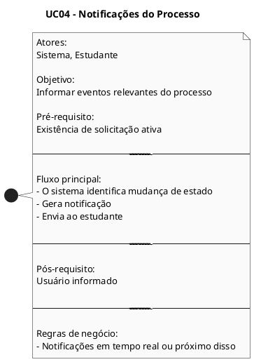
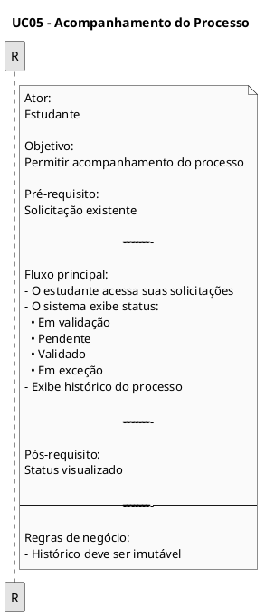
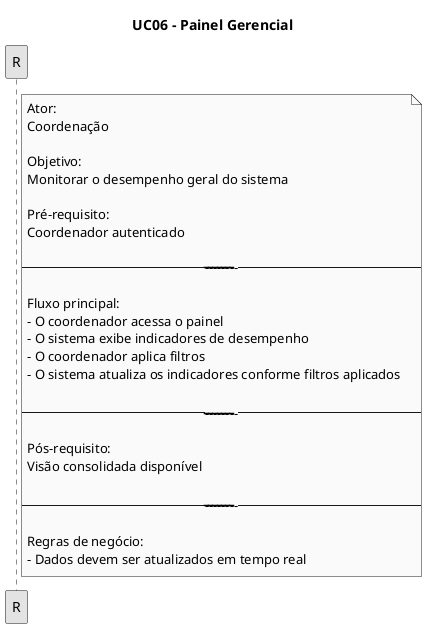
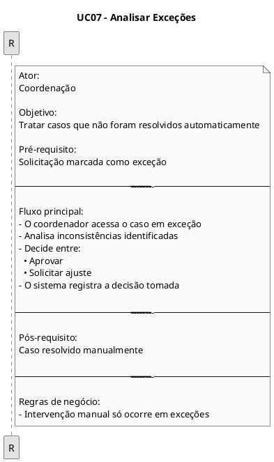
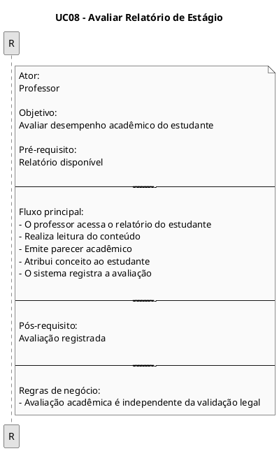
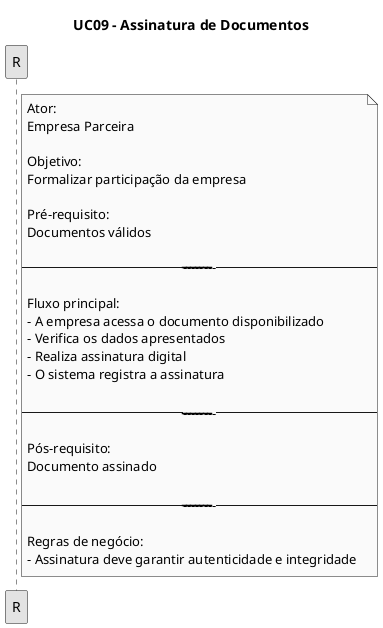
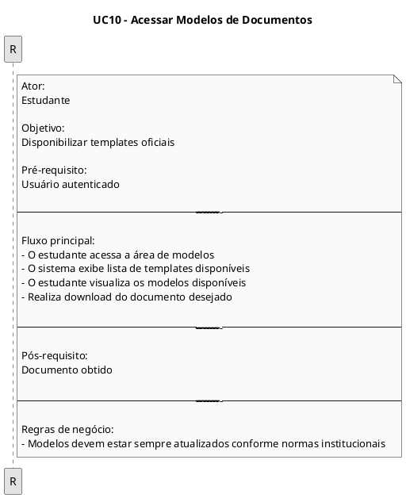

## Introdução

<p align = "justify">
Um protótipo de baixa fidelidade é uma representação visual simplificada de um sistema ou aplicação, voltada para a comunicação universal de suas funcionalidades e fluxos. A proposta desse tipo de protótipo é oferecer uma forma clara e acessível de representar o funcionamento geral da aplicação.
</p>

## Metodologia

<p align = "justify">
Iniciamos o projeto através dos levantamentos iniciais da equipe, após discussões a ferramenta Figma foi selecionada para produzir o protótipo de alta fidelidade com auxílio do Material Design Color Tool.
</p>

## Protótipo de alta fidelidade

### Versão 1.0

### Tela Login

### Tela Cadastro 1

```puml
@startuml
title UC02 – Validar Documentos

skinparam monochrome true
skinparam shadowing false

rectangle "Validação de Documentos" {
Status:
Iniciando validação ____________________

Regras Legais:
Aplicando Lei 11.788/2008 _____________

Regras Institucionais:
Validando critérios internos ___________

Análise:
Identificando inconsistências __________

Score de Conformidade:
Calculando ____________________________

----------------------------------------

[ Processar ]
[ Atualizar ]

----------------------------------------

Mensagem:
Falha na leitura -> documento inválido

Resultado:
Validação registrada ___________________

Regras:
- Tempo máximo: 15 segundos
- Score baseado na conformidade
}

@enduml
```


### Tela Cadastro 2


### Tela Esqueceu Senha
### Tela do Feed


### Tela Feed com configurações


### Tela Perfil


### Tela Cadastrar torneio 1


### Tela Cadastrar torneio 2

### Tela Cadastrar torneio 3


### Tela Cadastrar torneio 4

### Tela com meus torneios

[](../assets/Prototipo/image.png)

### Tela de inscrição em torneio

[](../assets/Prototipo/image.png)

<p align = "justify">
Na primeira versão do protótipo utilizamos a ferramenta <a href="https://material.io/resources/color/#!/?view.left=0&view.right=0">Material Design Color Tool</a>  para auxiliar na criação da paleta de cores do aplicativo, definimos as cores base do aplicativo mas as cores definidas para as telas 12 e 13 ainda não foram decididas.
</p>

### Versão 2.0

### Versão 1.0

### Tela Login

[](../assets/Prototipo/image.png)

### Tela Cadastro 1

[](../assets/Prototipo/image.png)

### Tela Cadastro 2

[](../assets/Prototipo/image.png)

### Tela Esqueceu Senha

[](../assets/Prototipo/image.png)

### Tela do Feed

[](../assets/Prototipo/image.png)

### Tela Feed com configurações

[](../assets/Prototipo/image.png)

### Tela Perfil

[](../assets/Prototipo/image.png)

### Tela Cadastrar torneio 1

[](../assets/Prototipo/image.png)

### Tela Cadastrar torneio 2

[](../assets/Prototipo/image.png)

### Tela Cadastrar torneio 3

[](../assets/Prototipo/image.png)

### Tela Cadastrar torneio 4

[](../assets/Prototipo/image.png)

### Tela com meus torneios

[](../assets/Prototipo/image.png)

### Tela de inscrição em torneio

[](../assets/Prototipo/image.png)

link para o `<a href="https://www.figma.com/">`Protótipo`</a>`

## Conclusão

<p align = "justify">
A partir da elaboração do protótipo foi possível ter uma noção inicial da interface do usuário, definindo fluxo, paleta de cores, botões, app bars e diversas outras funcionalidades
</p>

## Referências

> Material Design Color Tool. Disponível em:  https://material.io/resources/color/#!/?view.left=0&view.right=0

> PMI. Um guia do conhecimento em gerenciamento de projetos. Guia PMBOK® 5a. ed. EUA: Project Management Institute, 2013.

> Ferramenta Figma. Disponível em https://www.figma.com

## Autor(es)

| Data     | Versão | Descrição                            | Autor(es)                                                                            |
| -------- | ------- | -------------------------------------- | ------------------------------------------------------------------------------------ |
| 07/09/20 | 1.0     | Criação do documento                 | Lucas Alexandre e Matheus Estanislau                                                 |
| 07/09/20 | 1.1     | Adicionado as imagens do protótipo    | Lucas Alexandre e Matheus Estanislau                                                 |
| 07/09/20 | 1.2     | Adicionado conclusão e referências   | Lucas Alexandre e Matheus Estanislau                                                 |
| 26/10/20 | 2.0     | Adicionada a versão 2.0 do protótipo | João Pedro, Lucas Alexandre, Matheus Estanislau, Moacir Mascarenha e Renan Cristyan |
